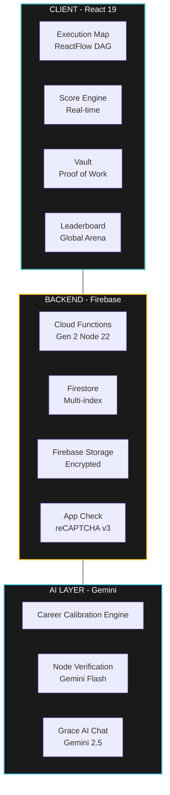

<div align="center">


# DISCOTIVE OS

### The Infrastructure Layer for Global Career Development.

**Stop Guessing. Start Executing.**

[](https://www.discotive.in)
[](https://react.dev)
[](https://firebase.google.com)
[](https://tailwindcss.com)
[](https://vitejs.dev)

</div>

---

## The Problem We're Solving

The global career development market is broken. Students waste 2-3 years in an information fog - consuming content without a clear execution roadmap, unable to verify their credibility, and competing blind on job platforms that prioritize resume keywords over real capability.

**Discotive converts a confusing professional future into a deterministic, verifiable, scored execution system.**

---

## System Architecture

<details>
<summary>📂 <b>View Full Repository Structure</b></summary>



</details>

---

## Core Modules

| Module                     | Description                                                                                       | Status            |
| -------------------------- | ------------------------------------------------------------------------------------------------- | ----------------- |
| **Execution Map**          | AI-generated ReactFlow DAG with dependency resolution, time-locks, and proof-of-work verification | ✅ Live           |
| **Discotive Score Engine** | Atomic Firestore transactions tracking 10+ score events — streaks, tasks, vault, network          | ✅ Live           |
| **Asset Vault**            | Zero-trust credential storage with Firebase Storage, SHA-256 hashing, admin verification pipeline | ✅ Live           |
| **Global Arena**           | Cursor-paginated leaderboard with multi-dimensional filtering (domain/niche/country)              | ✅ Live           |
| **Grace AI**               | Embedded career assistant powered by Gemini 2.5 Flash with structured flow + free-form chat       | ✅ Live           |
| **Neural Engine**          | Pure functional DAG compiler using Kahn's topological sort — O(V+E) state evaluation              | ✅ Live           |

---

## Tech Stack

### Frontend

- **Framework:** React 19 (Vite 7)
- **Routing:** React Router DOM v7
- **Styling:** Tailwind CSS 3.4 + clsx + tailwind-merge
- **Animation:** Framer Motion 12
- **Canvas:** ReactFlow 11 (DAG execution map)
- **Charts:** Recharts 3
- **PWA:** vite-plugin-pwa
- **PDF Export:** @react-pdf/renderer
- **Error Tracking:** Sentry

### Backend

- **Runtime:** Firebase Cloud Functions Gen 2 (Node 22)
- **Database:** Firestore (multi-region, composite indexes)
- **Storage:** Firebase Storage
- **Auth:** Firebase Auth (Email + Google OAuth)
- **Security:** Firebase App Check (reCAPTCHA Enterprise)
- **Payments:** Razorpay Subscriptions
- **AI:** Google Gemini 2.5 Flash + 1.5 Flash

### Infrastructure

- **Frontend Hosting:** Vercel (Edge CDN)
- **Functions:** Google Cloud Run (Gen 2)
- **Analytics:** Firebase Analytics + Umami (self-hosted)
- **Monitoring:** Sentry (Performance + Replay)
- **CI/CD:** Vercel Git Integration

---

```markdown
## Repository Structure

<details>
<summary>📂 <b>View Full Repository Structure</b></summary>

```text
discotive/
├── src/
│   ├── components/
│   │   ├── roadmap/        # ReactFlow canvas, node types, edge engine
│   │   ├── dashboard/      # Widgets, charts, telemetry components
│   │   └── ui/             # Base UI primitives
│   ├── contexts/
│   │   ├── AuthContext.jsx # Firebase Auth state
│   │   └── RoadmapContext.jsx # Neural engine + roadmap state
│   ├── hooks/
│   │   ├── useUserData.js  # Firestore user data with session cache
│   │   ├── useAIGateway.js # Secure Gemini API proxy
│   │   └── useVerificationAPI.js
│   ├── lib/
│   │   ├── roadmap/
│   │   │   ├── graphEngine.js # Pure functional DAG compiler
│   │   │   ├── idb.js        # IndexedDB persistence layer
│   │   │   ├── layout.js     # Dagre auto-layout engine
│   │   │   └── constants.js  # Single source of truth
│   │   ├── scoreEngine.js    # Atomic score mutations
│   │   ├── TierEngine.js     # Monetization limits
│   │   └── gemini.js         # AI gateway client
│   ├── pages/              # Route-level components
│   └── layouts/            # MainLayout with dual-paradigm nav
├── functions/
│   └── index.js            # All Cloud Functions (Gen 2)
├── firestore.rules         # Security rules
├── firestore.indexes.json  # Composite indexes
└── vite.config.js

```  

---

## Getting Started

### Prerequisites

- Node.js 22+
- Firebase CLI: `npm install -g firebase-tools`
- A Firebase project with Blaze plan (required for Cloud Functions)

### 1. Clone & Install

```bash
git clone https://github.com/discotive/discotive-os.git
cd discotive-os
npm install
cd functions && npm install && cd ..
```

### 2. Environment Variables

Create `.env.local` in the root:

```env
# Firebase Client Config
VITE_FIREBASE_API_KEY=
VITE_FIREBASE_AUTH_DOMAIN=
VITE_FIREBASE_PROJECT_ID=
VITE_FIREBASE_STORAGE_BUCKET=
VITE_FIREBASE_MESSAGING_SENDER_ID=
VITE_FIREBASE_APP_ID=
VITE_FIREBASE_MEASUREMENT_ID=

# Security
VITE_RECAPTCHA_KEY=          # reCAPTCHA Enterprise site key

# Payments
VITE_RAZORPAY_KEY_ID=        # Public key only

# Monitoring
VITE_SENTRY_DSN=
VITE_APPCHECK_DEBUG_TOKEN=   # Dev only
```

Firebase Function secrets (set via CLI):

```bash
firebase functions:secrets:set RAZORPAY_KEY_ID
firebase functions:secrets:set RAZORPAY_KEY_SECRET
firebase functions:secrets:set RAZORPAY_WEBHOOK_SECRET
firebase functions:secrets:set GEMINI_API_KEY
```

### 3. Deploy Backend

```bash
# Deploy security rules
firebase deploy --only firestore:rules

# Deploy indexes
firebase deploy --only firestore:indexes

# Deploy functions
firebase deploy --only functions
```

### 4. Run Development Server

```bash
npm run dev
```

### 5. Deploy Frontend

```bash
# Vercel (recommended)
npm run build
vercel --prod

# Or configure Vercel GitHub integration for automatic deploys
```

---

## Deployment Checklist

Before every production deployment, verify:

- [ ] `npm run lint` passes with zero errors
- [ ] `npm run build` completes without warnings
- [ ] All Firestore security rules deployed: `firebase deploy --only firestore:rules`
- [ ] All Cloud Function secrets configured in Firebase console
- [ ] Razorpay webhook URL updated in Razorpay dashboard
- [ ] App Check enforcement enabled in Firebase console (NOT enforcement mode during initial testing)
- [ ] Sentry DSN configured in Vercel environment variables
- [ ] vercel.json rewrite rules verified for public profile routing

---

## Score Engine Reference

The Discotive Score tracks the following events atomically via Firestore transactions:

| Event                         | Points    | Notes                               |
| ----------------------------- | --------- | ----------------------------------- |
| Daily Login                   | +10       | IST timezone, once per calendar day |
| OS Initialization             | +70       | One-time onboarding bonus           |
| Onboarding Complete           | +50       | After 8-step profile completion     |
| Task Execution                | +5 to +30 | Per task, based on node type        |
| Task Reverted                 | -15       | Unchecking a completed task         |
| Vault Asset Verified (Weak)   | +10       | Admin-assigned                      |
| Vault Asset Verified (Medium) | +20       | Admin-assigned                      |
| Vault Asset Verified (Strong) | +30       | Admin-assigned                      |
| Alliance Forged               | +15       | Mutual connection accepted          |
| Alliance Sent                 | +5        | Rate-limited: 5/day max             |
| Missed Day Penalty            | -15       | Applied by CRON at 23:59 IST        |
| Profile View                  | +1        | Unique per device per profile       |

---

## Architecture Decisions

### Why ReactFlow for the Execution Map?

The execution map is a Directed Acyclic Graph (DAG) — not a flowchart. ReactFlow gives us the mathematical substrate (handle connections, edge routing, viewport management) while our custom `graphEngine.js` implements Kahn's topological algorithm to compute node states in O(V+E) time. Every node knows its computed state without server round-trips.

### Why Firebase over Supabase/PlanetScale?

Three reasons: (1) Firebase App Check provides the best client-side abuse prevention for a public consumer app; (2) Firestore's real-time listeners are zero-configuration; (3) Firebase Auth + Storage + Functions in a single ecosystem eliminates cross-service CORS complexity. The tradeoff is cost at scale — we'll migrate the leaderboard to BigQuery at 100k MAU.

### Why Gemini over OpenAI?

Google Cloud's shared billing with Firebase Functions keeps the cost-per-request lowest for our Gen 2 functions. Gemini 1.5 Flash's structured JSON output mode eliminates regex parsing for map generation. Gemini 2.5 Flash powers Grace with lower latency than GPT-4o for conversational responses.

---

## Contributing

This is an internal engineering repository. External contributions are not accepted at this stage.

**Internal Team Protocol:**

1. All features branch from `main` with prefix `feat/`, `fix/`, `hotfix/`
2. No direct pushes to `main` — all changes via Pull Request
3. PRs require one senior engineer review
4. Cloud Functions must pass `firebase deploy --only functions` locally before PR
5. All new Firestore queries must have corresponding composite indexes in `firestore.indexes.json`

**Code Standards:**

- Zero `console.log` in production code — use `console.error` with context tags `[ModuleName]`
- All Cloud Functions must be Gen 2 (`firebase-functions/v2/https`)
- React state mutations must be atomic — no chained `setState` calls
- Score mutations must go through `scoreEngine.js` — never direct Firestore writes

---

## Security

Found a vulnerability? Email security@discotive.in immediately. Do not open a public GitHub issue.

All vulnerability reports receive a response within 24 hours.

---

## License

Proprietary. All rights reserved. © 2026 Discotive.

---

<div align="center">

**Built by operators. For operators.**

[discotive.in](https://www.discotive.in) · [Follow our journey](https://twitter.com/discotive)

</div>
